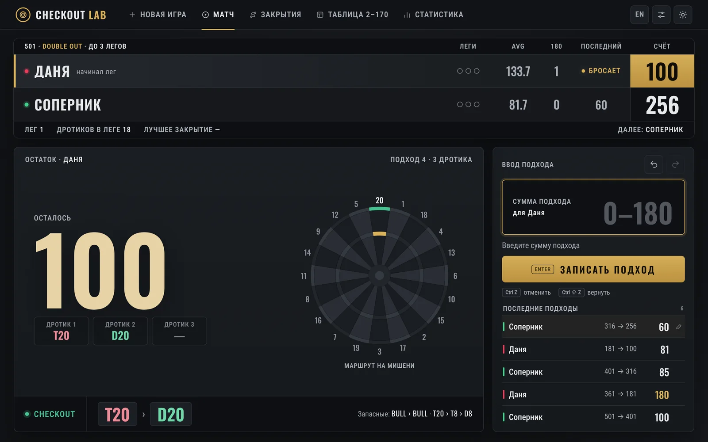
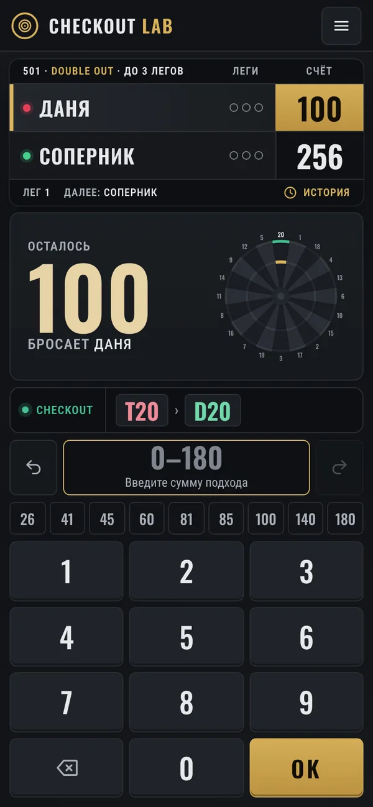
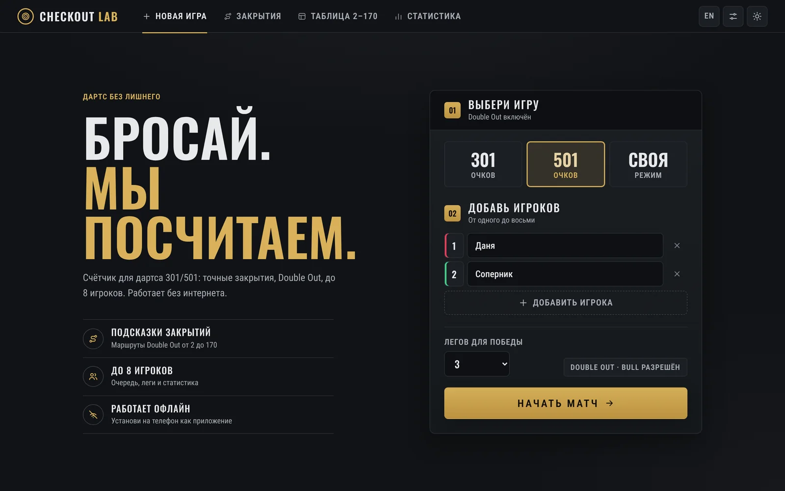
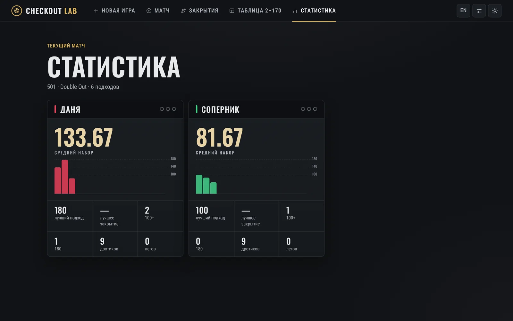
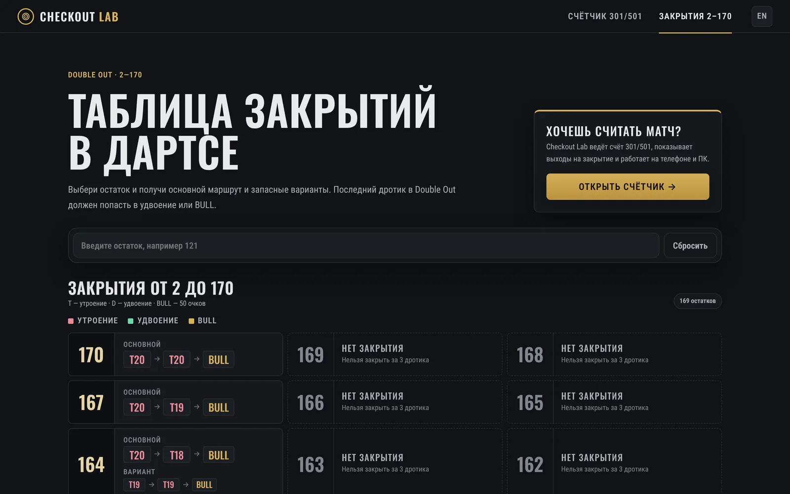
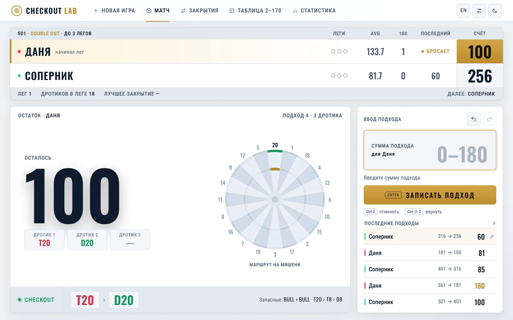

<div align="center">


# Checkout Lab

**Счётчик для дартса 301 / 501 в стиле ТВ-трансляции**<br>
Подсказки закрытий Double Out, статистика матча, до 8 игроков и полноценный офлайн-режим.

[](https://checkoutlab.ru/)
[](https://checkoutlab.ru/en/)

[](https://github.com/denbogos/checkout-lab/actions/workflows/quality.yml)


<br>



</div>

---

## Возможности

| | |
|---|---|
| 🎯 **Игры 301 / 501** | и свой стартовый счёт от 2 до 5001, Double Out, Bull разрешён |
| 👥 **До 8 игроков** | матч до 1–7 легов, очередь и смена начинающего в каждом леге |
| 🧭 **Подсказки закрытий** | основной маршрут и запасные варианты; план по дротикам и маршрут на мишени |
| 📺 **Табло как в трансляции** | леги, средний набор, 180, последний подход, дротики в леге, лучшее закрытие |
| 🎉 **События 180 / BUST / LEG** | анимированная плашка с именем игрока, звук и вибрация по желанию |
| 📊 **Статистика** | средний набор, лучший подход и закрытие, 100+, 180 и график подходов |
| ✏️ **Правка и отмена** | Undo / Redo, исправление или удаление последнего подхода |
| 🛡️ **Проверка ввода** | невозможные суммы за три дротика, BUST, выбор удвоения при закрытии |
| 📴 **Офлайн и PWA** | устанавливается на телефон и ПК, работает без интернета |
| 🌗 **Две темы и два языка** | тёмная и светлая тема, русский и английский |

## Скриншоты

<table>
  <tr>
    <td width="30%" valign="top"><br><sub><b>Телефон</b> — весь матч на одном экране, крупная клавиатура</sub></td>
    <td valign="top">
      <br><sub><b>Новая игра</b> — режим, игроки и число легов</sub><br><br>
      <br><sub><b>Статистика</b> — средний набор и график подходов</sub>
    </td>
  </tr>
  <tr>
    <td colspan="2"><br><sub><b>Таблица закрытий 2–170</b> — поиск по остатку, основной маршрут и варианты</sub></td>
  </tr>
  <tr>
    <td colspan="2"><br><sub><b>Светлая тема</b></sub></td>
  </tr>
</table>

## Как пользоваться

1. Откройте [checkoutlab.ru](https://checkoutlab.ru/), выберите **301**, **501** или свой счёт.
2. Добавьте игроков и число легов для победы, нажмите **«Начать матч»**.
3. После каждого подхода вводите сумму трёх дротиков.

**На компьютере** — наберите сумму и нажмите <kbd>Enter</kbd>.
<kbd>Ctrl</kbd> + <kbd>Z</kbd> отменяет подход, <kbd>Ctrl</kbd> + <kbd>Shift</kbd> + <kbd>Z</kbd> возвращает.

**На телефоне** — крупная клавиатура и быстрые суммы (26, 41, 45, 60, 81, 85, 100, 140, 180).
Нажмите на игрока в табло, чтобы посмотреть его выход на закрытие.
Режим **«У мишени»** открывает матч на весь экран, а экран не гаснет во время игры.

## Обозначения

| Метка | Значение |
|---|---|
| `S20` | одиночный сектор 20 |
| `D20` | удвоение 20 — 40 очков |
| `T20` | утроение 20 — 60 очков |
| `BULL` | внутренний Bull — 50 очков, считается удвоением |

В маршрутах с двумя утроениями первым идёт большее: `T20 › T19 › D20`.
Остатки **169, 168, 166, 165, 163, 162, 159** нельзя закрыть за три дротика — приложение подсказывает, как подготовить следующий подход.

## Страницы сайта

| Русский | English |
|---|---|
| [Счётчик 301 / 501](https://checkoutlab.ru/) | [Darts scorer](https://checkoutlab.ru/en/) |
| [Таблица закрытий 2–170](https://checkoutlab.ru/checkout-table.html) | [Checkout table](https://checkoutlab.ru/en/checkout-table.html) |
| [Калькулятор закрытий](https://checkoutlab.ru/checkout-calculator.html) | [Checkout calculator](https://checkoutlab.ru/en/checkout-calculator.html) |
| [Счётчик 501](https://checkoutlab.ru/darts-501.html) · [301](https://checkoutlab.ru/darts-301.html) | [501](https://checkoutlab.ru/en/darts-501.html) · [301](https://checkoutlab.ru/en/darts-301.html) |
| [Правила Double Out](https://checkoutlab.ru/double-out.html) | [Double Out rules](https://checkoutlab.ru/en/double-out.html) |

У каждой страницы свой canonical, `hreflang` и мета-теги для поисковиков.

## Технологии

Без фреймворков и сборки — сайт работает прямо из файлов репозитория.

- **HTML, CSS, Vanilla JavaScript**
- **Service Worker** и Web App Manifest — установка и офлайн-режим
- **Screen Wake Lock API** — экран не гаснет во время матча
- **Web Audio** и Vibration API — звук и отклик
- Шрифты **Oswald** и **Roboto Condensed** лежат в репозитории, чтобы работать без интернета
- Хостинг — **GitHub Pages**

```
├── index.html            приложение (RU), en/index.html — EN
├── app.js                логика матча, закрытия и интерфейс
├── styles.css            дизайн-система: темы, табло, телефон
├── i18n.js               перевод интерфейса на английский
├── audio-engine.js       звуки событий
├── sw.js                 офлайн-кэш
├── checkout-table.html   таблица закрытий 2–170
├── *.html + seo.css      справочные страницы
├── fonts/                Oswald и Roboto Condensed (SIL OFL)
└── tests/                тесты логики игры и сайта
```

## Разработка

```bash
# локальный сервер
npx http-server -c-1 .

# тесты
npm test
node --check app.js && node --check sw.js
```

Тесты запускаются в GitHub Actions на каждый push и pull request.

> При изменении стилей или скриптов увеличьте версию кэша в `sw.js` (`CACHE=…`) и в `tests/static-site.test.mjs`, иначе у пользователей останется старая версия из офлайн-кэша.

## Развёртывание

Сайт публикуется из ветки **`main`** через GitHub Pages на домене **[checkoutlab.ru](https://checkoutlab.ru/)**.
Файлы `CNAME`, `robots.txt`, `sitemap.xml` и файлы подтверждения поисковых систем должны оставаться в корне репозитория.

---

<div align="center">

**Checkout Lab** — бросай, мы посчитаем. 🎯

</div>
